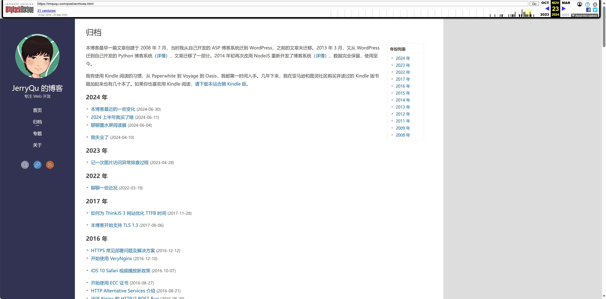

# JerryQu 的个人博客
前端大佬 JerryQu  的秒开个人博客：[https://imququ.com）](https://imququ.com]() 备份  
自2024年12月28日关站后，这个优质博客就无法访问了，出于学习、观摩目的，备份该博客内容。

## 一、备份

### 1.WayBackMachine（最后可见备份2024年11月23日）

[https://web.archive.org/web/20241123011127/https://imququ.com/post/archives.html）](https://web.archive.org/web/20241123011127/https://imququ.com/post/archives.html)

### 2.MOBI电子书版（作者本人最后修改于 2016 年 08 月 22 日）

1.DropBOX（作者本人）：
[https://www.dropbox.com/s/e79xi1g4urqskrw/JerryQu%E7%9A%84%E5%B0%8F%E7%AB%99.mobi?dl=0](https://www.dropbox.com/s/e79xi1g4urqskrw/JerryQu%E7%9A%84%E5%B0%8F%E7%AB%99.mobi?dl=0)

2.GitHub
（1）GitHub官方：
（2）中国大陆加速地址：
封面预览：

## 二、文章归档（WayBackMachine链接）

**2024 年**

- [本博客最近的一些变化 (2024-06-30）](https://web.archive.org/web/20241123011127/https://imququ.com/post/recent-changes-to-my-blog.html)
- [2024 上半年我买了啥 (2024-06-11）](https://web.archive.org/web/20241123011127/https://imququ.com/post/good-things-2024h1.html)
- [聊聊墨水屏阅读器 (2024-06-04）](https://web.archive.org/web/20241123011127/https://imququ.com/post/ebook-reader.html)
- [我失业了 (2024-04-10）](https://web.archive.org/web/20241123011127/https://imququ.com/post/i-am-unemployed.html)

**2023 年**
- [记一次图片访问异常排查过程 (2023-04-28）](https://web.archive.org/web/20241123011127/https://imququ.com/post/an-avatar-issue.html)

**2022 年**
- [聊聊一些近况 (2022-03-19）](https://web.archive.org/web/20241123011127/https://imququ.com/post/my-recent-work-and-life.html)

**2017 年**
- [如何为 ThinkJS 3 网站优化 TTFB 时间 (2017-11-28）](https://web.archive.org/web/20241123011127/https://imququ.com/post/reduce-ttfb-on-thinkjs3-website.html)
- [本博客开始支持 TLS 1.3 (2017-08-06）](https://web.archive.org/web/20241123011127/https://imququ.com/post/enable-tls-1-3.html)

**2016 年**
- [HTTPS 常见部署问题及解决方案 (2016-12-12）](https://web.archive.org/web/20241123011127/https://imququ.com/post/troubleshooting-https.html)
- [开始使用 VeryNginx (2016-12-10）](https://web.archive.org/web/20241123011127/https://imququ.com/post/use-verynginx.html)
- [iOS 10 Safari 视频播放新政策 (2016-10-07）](https://web.archive.org/web/20241123011127/https://imququ.com/post/new-video-policies-for-ios10.html)
- [开始使用 ECC 证书 (2016-08-27）](https://web.archive.org/web/20241123011127/https://imququ.com/post/ecc-certificate.html)
- [HTTP Alternative Services 介绍 (2016-08-21）](https://web.archive.org/web/20241123011127/https://imququ.com/post/http-alt-svc.html)
- [谈谈 Nginx 的 HTTP/2 POST Bug (2016-08-20）](https://web.archive.org/web/20241123011127/https://imququ.com/post/nginx-http2-post-bug.html)
- [开始使用 Docker (2016-08-14）](https://web.archive.org/web/20241123011127/https://imququ.com/post/use-docker.html)
- [移动 WEB 通用优化策略介绍（二） (2016-08-14）](https://web.archive.org/web/20241123011127/https://imququ.com/post/wpo-of-mobile-web-2.html)
- [博客统计报告（2016 上半年） (2016-05-27）](https://web.archive.org/web/20241123011127/https://imququ.com/post/first-half-of-2016-blog-analytics.html)
- [为什么我们应该尽快支持 ALPN？ (2016-05-18）](https://web.archive.org/web/20241123011127/https://imququ.com/post/enable-alpn-asap.html)
- [为什么我们应该尽快升级到 HTTPS？ (2016-05-16）](https://web.archive.org/web/20241123011127/https://imququ.com/post/moving-to-https-asap.html)
- [关于启用 HTTPS 的一些经验分享（三） (2016-05-05）](https://web.archive.org/web/20241123011127/https://imququ.com/post/sth-about-switch-to-https-3.html)
- [如何压缩 HTTP 请求正文 (2016-04-18）](https://web.archive.org/web/20241123011127/https://imququ.com/post/how-to-compress-http-request-body.html)
- [HTTP 协议中的 Content-Encoding (2016-04-17）](https://web.archive.org/web/20241123011127/https://imququ.com/post/content-encoding-header-in-http.html)
- [Chrome 中 scrollingElement 的变化 (2016-04-16）](https://web.archive.org/web/20241123011127/https://imququ.com/post/document-scrollingelement-in-chrome.html)
- [移动 WEB 通用优化策略介绍（一） (2016-04-16）](https://web.archive.org/web/20241123011127/https://imququ.com/post/wpo-of-mobile-web-1.html)
- [谈谈 HTTP/2 的协议协商机制 (2016-04-14）](https://web.archive.org/web/20241123011127/https://imququ.com/post/protocol-negotiation-in-http2.html)
- [三种解密 HTTPS 流量的方法介绍 (2016-03-28）](https://web.archive.org/web/20241123011127/https://imququ.com/post/how-to-decrypt-https.html)
- [本博客 Nginx 配置之完整篇 (2016-03-21）](https://web.archive.org/web/20241123011127/https://imququ.com/post/my-nginx-conf.html)
- [从无法开启 OCSP Stapling 说起 (2016-03-13）](https://web.archive.org/web/20241123011127/https://imququ.com/post/why-can-not-turn-on-ocsp-stapling.html)
- [利用图片传输数据的另类思路 (2016-03-10）](https://web.archive.org/web/20241123011127/https://imququ.com/post/use-image-to-transfer-data.html)
- [使用 nghttp2 调试 HTTP/2 流量 (2016-03-07）](https://web.archive.org/web/20241123011127/https://imququ.com/post/intro-to-nghttp2.html)
- [HTTP Public Key Pinning 介绍 (2016-03-05）](https://web.archive.org/web/20241123011127/https://imququ.com/post/http-public-key-pinning.html)
- [Certificate Transparency 那些事 (2016-02-03）](https://web.archive.org/web/20241123011127/https://imququ.com/post/certificate-transparency.html)
- [从启用 HTTP/2 导致网站无法访问说起 (2016-01-17）](https://web.archive.org/web/20241123011127/https://imququ.com/post/why-tls-handshake-failed-with-http2-enabled.html)
- [使用 Elasticsearch 实现博客站内搜索 (2016-01-05）](https://web.archive.org/web/20241123011127/https://imququ.com/post/elasticsearch.html)

**2015 年**
- [Let's Encrypt，免费好用的 HTTPS 证书 (2015-12-25）](https://web.archive.org/web/20241123011127/https://imququ.com/post/letsencrypt-certificate.html)
- [关于启用 HTTPS 的一些经验分享（二） (2015-12-22）](https://web.archive.org/web/20241123011127/https://imququ.com/post/sth-about-switch-to-https-2.html)
- [从 Nginx 默认不压缩 HTTP/1.0 说起 (2015-12-15）](https://web.archive.org/web/20241123011127/https://imququ.com/post/why-nginx-disable-gzip-in-http10.html)
- [关于启用 HTTPS 的一些经验分享（一） (2015-12-04）](https://web.archive.org/web/20241123011127/https://imququ.com/post/sth-about-switch-to-https.html)
- [域名小知识：Public Suffix List (2015-11-28）](https://web.archive.org/web/20241123011127/https://imququ.com/post/domain-public-suffix-list.html)
- [基于 HTTP/2 的 WEB 内网穿透实现 (2015-11-23）](https://web.archive.org/web/20241123011127/https://imququ.com/post/tunnel-to-localhost-base-on-http2.html)
- [HTTP/2：新的机遇与挑战 (2015-11-22）](https://web.archive.org/web/20241123011127/https://imququ.com/post/http2-new-opportunities-and-challenges.html)
- [HTTP 代理原理及实现（二） (2015-11-20）](https://web.archive.org/web/20241123011127/https://imququ.com/post/web-proxy-2.html)
- [HTTP 代理原理及实现（一） (2015-11-20）](https://web.archive.org/web/20241123011127/https://imququ.com/post/web-proxy.html)
- [Golomb-coded sets 原理介绍 (2015-11-16）](https://web.archive.org/web/20241123011127/https://imququ.com/post/golomb-coded-sets.html)
- [TLS 握手优化详解 (2015-11-08）](https://web.archive.org/web/20241123011127/https://imququ.com/post/optimize-tls-handshake.html)
- [ThinkJS 2.0，带你超越梦想一起飞 (2015-10-30）](https://web.archive.org/web/20241123011127/https://imququ.com/post/thinkjs-2.html)
- [HTTP/2 头部压缩技术介绍 (2015-10-25）](https://web.archive.org/web/20241123011127/https://imququ.com/post/header-compression-in-http2.html)
- [使用 Wireshark 调试 HTTP/2 流量 (2015-10-24）](https://web.archive.org/web/20241123011127/https://imququ.com/post/http2-traffic-in-wireshark.html)
- [H2O 中的 Cache-Aware Server Push 简介 (2015-10-21）](https://web.archive.org/web/20241123011127/https://imququ.com/post/cache-aware-server-push-in-h2o.html)
- [使用 BoringSSL 优化 HTTPS 加密算法选择 (2015-10-15）](https://web.archive.org/web/20241123011127/https://imququ.com/post/optimize-ssl-ciphers-with-boringssl.html)
- [Disqus，我又回来了！ (2015-10-14）](https://web.archive.org/web/20241123011127/https://imququ.com/post/back-to-disqus.html)
- [AMP，来自 Google 的移动页面优化方案 (2015-10-10）](https://web.archive.org/web/20241123011127/https://imququ.com/post/amp-project.html)
- [window.opener.location 安全风险讨论 (2015-10-09）](https://web.archive.org/web/20241123011127/https://imququ.com/post/the-security-of-window-opener-location.html)
- [Content Security Policy Level 2 介绍 (2015-10-05）](https://web.archive.org/web/20241123011127/https://imququ.com/post/content-security-policy-level-2.html)
- [让多说评论框完美支持 HTTPS (2015-09-27）](https://web.archive.org/web/20241123011127/https://imququ.com/post/duoshuo-and-https.html)
- [使用 SRI 增强 localStorage 代码安全 (2015-09-26）](https://web.archive.org/web/20241123011127/https://imququ.com/post/enhance-security-for-ls-code.html)
- [Subresource Integrity 介绍 (2015-09-23）](https://web.archive.org/web/20241123011127/https://imququ.com/post/subresource-integrity.html)
- [像素化你的代码 (2015-09-19）](https://web.archive.org/web/20241123011127/https://imququ.com/post/code2png-encoder.html)
- [本博客零散优化点汇总 (2015-09-12）](https://web.archive.org/web/20241123011127/https://imququ.com/post/summary-of-my-blog-optimization.html)
- [诡异问题排查之「DataURI 引发的血案」 (2015-09-12）](https://web.archive.org/web/20241123011127/https://imququ.com/post/datauri-and-404.html)
- [HTTP Client Hints 介绍 (2015-09-10）](https://web.archive.org/web/20241123011127/https://imququ.com/post/http-client-hints.html)
- [关于本站备案那点事 (2015-09-03）](https://web.archive.org/web/20241123011127/https://imququ.com/post/about-miitbeian.html)
- [HTTP/2 资料汇总 (2015-08-31）](https://web.archive.org/web/20241123011127/https://imququ.com/post/http2-resource.html)
- [开始使用 Vagrant (2015-08-23）](https://web.archive.org/web/20241123011127/https://imququ.com/post/vagrantup.html)
- [Bugtags, 让移动应用测试变得更轻松 (2015-08-17）](https://web.archive.org/web/20241123011127/https://imququ.com/post/intro-to-bugtags.html)
- [Nginx 开始支持 HTTP/2 了 (2015-08-16）](https://web.archive.org/web/20241123011127/https://imququ.com/post/nginx-http2-patch.html)
- [HTTP/2 中的 Server Push 讨论 (2015-06-16）](https://web.archive.org/web/20241123011127/https://imququ.com/post/server-push-in-http2.html)
- [ThinkJS 中的 Behavior 介绍 (2015-06-11）](https://web.archive.org/web/20241123011127/https://imququ.com/post/thinkjs-behavior.html)
- [开始使用 HTTP/2 (2015-06-07）](https://web.archive.org/web/20241123011127/https://imququ.com/post/use-http2-now.html)
- [浏览器中常见网络协议介绍 (2015-06-03）](https://web.archive.org/web/20241123011127/https://imququ.com/post/network-protocol-in-browser.html)
- [HTTP/2 与 WEB 性能优化（三） (2015-06-01）](https://web.archive.org/web/20241123011127/https://imququ.com/post/http2-and-wpo-3.html)
- [使用两步验证提高账号安全性 (2015-05-31）](https://web.archive.org/web/20241123011127/https://imququ.com/post/about-two-factor-authentication.html)
- [本博客 Nginx 配置之性能篇 (2015-05-27）](https://web.archive.org/web/20241123011127/https://imququ.com/post/my-nginx-conf-for-wpo.html)
- [本博客 Nginx 配置之安全篇 (2015-05-24）](https://web.archive.org/web/20241123011127/https://imququ.com/post/my-nginx-conf-for-security.html)
- [HTTP/2 与 WEB 性能优化（二） (2015-05-22）](https://web.archive.org/web/20241123011127/https://imququ.com/post/http2-and-wpo-2.html)
- [HTTP/2 与 WEB 性能优化（一） (2015-05-19）](https://web.archive.org/web/20241123011127/https://imququ.com/post/http2-and-wpo-1.html)
- [改进 ThinkJS 的异步编程方式 (2015-05-15）](https://web.archive.org/web/20241123011127/https://imququ.com/post/thinkjs-async-coding.html)
- [Referrer Policy 介绍「续」 (2015-05-11）](https://web.archive.org/web/20241123011127/https://imququ.com/post/referrer-policy-2.html)
- [9.9 美元一年的 VPS 及配置指南 (2015-05-11）](https://web.archive.org/web/20241123011127/https://imququ.com/post/bandwagon-vps-and-basicly-usage.html)
- [Referrer 还是 Referer？ (2015-05-09）](https://web.archive.org/web/20241123011127/https://imququ.com/post/referrer-or-referer.html)
- [Referrer Policy 介绍 (2015-05-06）](https://web.archive.org/web/20241123011127/https://imququ.com/post/referrer-policy.html)
- [HTTP 协议中的 Transfer-Encoding (2015-05-04）](https://web.archive.org/web/20241123011127/https://imququ.com/post/transfer-encoding-header-in-http.html)
- [HTTP 请求头中的 X-Forwarded-For (2015-05-02）](https://web.archive.org/web/20241123011127/https://imququ.com/post/x-forwarded-for-header-in-http.html)
- [HTML5 视频直播（三） (2015-05-01）](https://web.archive.org/web/20241123011127/https://imququ.com/post/html5-live-player-3.html)
- [HTML5 视频直播（二） (2015-04-25）](https://web.archive.org/web/20241123011127/https://imququ.com/post/html5-live-player-2.html)
- [HTML5 视频直播（一） (2015-04-24）](https://web.archive.org/web/20241123011127/https://imququ.com/post/html5-live-player-1.html)
- [针对不同主机使用不同 SSH Key (2015-04-19）](https://web.archive.org/web/20241123011127/https://imququ.com/post/multiple-ssh-keys-with-different-hosts.html)
- [搭建 ngrok 服务实现内网穿透 (2015-04-19）](https://web.archive.org/web/20241123011127/https://imququ.com/post/self-hosted-ngrokd.html)

**2014 年**
- [1.5kb 代码让图片抖起来 (2014-08-11）](https://web.archive.org/web/20241123011127/https://imququ.com/post/shake-photo-in-little-js.html)
- [移动 Web 与 JavaScript 定时器 (2014-03-27）](https://web.archive.org/web/20241123011127/https://imququ.com/post/mobile-web-and-js-timer.html)
- [Chrome 和 Web Fonts 二三事 (2014-03-24）](https://web.archive.org/web/20241123011127/https://imququ.com/post/chrome-and-web-fonts.html)
- [SPDY 3.1 中的请求 / 响应头 (2014-03-15）](https://web.archive.org/web/20241123011127/https://imququ.com/post/spdy-3-1-headers.html)
- [Chrome 32 开发者工具的几个变化 (2014-01-19）](https://web.archive.org/web/20241123011127/https://imququ.com/post/devtool-in-chrome32.html)
- [HTTP 协议中 Vary 的一些研究 (2014-01-01）](https://web.archive.org/web/20241123011127/https://imququ.com/post/vary-header-in-http.html)

**2013 年**
- [Webkit 异步加载 CSS 的奇怪现象 (2013-12-25）](https://web.archive.org/web/20241123011127/https://imququ.com/post/webkit-load-css-issues.html)
- [小成本实现部分选中的复选框 (2013-12-22）](https://web.archive.org/web/20241123011127/https://imququ.com/post/native-tri-state-checkbox.html)
- [devicePixelRatio = 1.5 引发的问题 (2013-12-20）](https://web.archive.org/web/20241123011127/https://imququ.com/post/devicepixelratio-and-border-width.html)
- [页面动画滚动的交互细节 (2013-12-08）](https://web.archive.org/web/20241123011127/https://imququ.com/post/animated-scrolling-in-web.html)
- [BOM 和 JavaScript 中的 trim (2013-12-07）](https://web.archive.org/web/20241123011127/https://imququ.com/post/bom-and-javascript-trim.html)
- [AMD 的 CommonJS wrapping (2013-12-05）](https://web.archive.org/web/20241123011127/https://imququ.com/post/amd-simplified-commonjs-wrapping.html)
- [Chrome 滚动条冻结现象 (2013-12-02）](https://web.archive.org/web/20241123011127/https://imququ.com/post/chrome-scrollbar-freeze.html)
- [Genymotion：超赞的安卓虚拟机 (2013-11-28）](https://web.archive.org/web/20241123011127/https://imququ.com/post/genymotion.html)
- [两个常见的 Affix 交互问题 (2013-11-25）](https://web.archive.org/web/20241123011127/https://imququ.com/post/two-little-details-of-affix.html)
- [开始用 Markdown 写博客 (2013-11-24）](https://web.archive.org/web/20241123011127/https://imququ.com/post/use-markdown-on-my-blog.html)
- [本博客正式启用 HTTPS (2013-11-22）](https://web.archive.org/web/20241123011127/https://imququ.com/post/switch-to-https.html)
- [Chrome 31 的一个 Bug（已修复） (2013-11-14）](https://web.archive.org/web/20241123011127/https://imququ.com/post/a-bug-with-chrome31.html)
- [打造 Mac 下的完美开发环境 (2013-10-09）](https://web.archive.org/web/20241123011127/https://imququ.com/post/my-dev-env-in-macos.html)
- [iOS7 中 Safari 的一个离奇 Bug (2013-10-08）](https://web.archive.org/web/20241123011127/https://imququ.com/post/a-bug-with-safari-in-ios7.html)
- [FileSystem API 实现文件下载器 2 (2013-10-01）](https://web.archive.org/web/20241123011127/https://imququ.com/post/a-downloader-with-filesystem-api-2.html)
- [用 FileSystem API 实现文件下载器 (2013-10-01）](https://web.archive.org/web/20241123011127/https://imququ.com/post/a-downloader-with-filesystem-api.html)
- [不会被 iOS 停掉的网页定时器 (2013-09-25）](https://web.archive.org/web/20241123011127/https://imququ.com/post/ios-none-freeze-timer.html)
- [ES6 中的 Set、Map 和 WeakMap (2013-09-23）](https://web.archive.org/web/20241123011127/https://imququ.com/post/set-map-weakmap-in-es6.html)
- [ES6 中的生成器函数介绍 (2013-09-20）](https://web.archive.org/web/20241123011127/https://imququ.com/post/generator-function-in-es6.html)
- [image-orientation: 让图片自动旋转 (2013-09-15）](https://web.archive.org/web/20241123011127/https://imququ.com/post/how-to-auto-rotate-photo-in-css.html)
- [如何在 Mac 下使用 Fiddler (2013-09-13）](https://web.archive.org/web/20241123011127/https://imququ.com/post/use-fiddler-on-macos.html)
- [尝试 ES6 中的箭头函数 (2013-09-11）](https://web.archive.org/web/20241123011127/https://imququ.com/post/arrow-function-in-es6.html)
- [中英文混排及中文引号 (2013-09-10）](https://web.archive.org/web/20241123011127/https://imququ.com/post/typography-of-my-blog.html)
- [IE 的浏览器模式和文本模式（二） (2013-09-07）](https://web.archive.org/web/20241123011127/https://imququ.com/post/browser-mode-and-document-mode-in-ie-2.html)
- [看懂 Fiddler 的瀑布图 (2013-09-04）](https://web.archive.org/web/20241123011127/https://imququ.com/post/timeline-in-fiddler.html)
- [打造自己的在线收藏服务 (2013-09-01）](https://web.archive.org/web/20241123011127/https://imququ.com/post/my-online-collection-service.html)
- [firebug1.12 更新 (2013-08-29）](https://web.archive.org/web/20241123011127/https://imququ.com/post/firebug-1-12.html)
- [Http 请求头中的 Proxy-Connection (2013-08-26）](https://web.archive.org/web/20241123011127/https://imququ.com/post/the-proxy-connection-header-in-http-request.html)
- [四种常见的 POST 提交数据方式 (2013-08-21）](https://web.archive.org/web/20241123011127/https://imququ.com/post/four-ways-to-post-data-in-http.html)
- [使用 Canvas 绘制背景图 (2013-08-18）](https://web.archive.org/web/20241123011127/https://imququ.com/post/use-canvas-as-background-image.html)
- [[小Tip]用好浏览器的控制台 (2013-08-11）](https://web.archive.org/web/20241123011127/https://imququ.com/post/about-browser-devtools-console.html)
- [一些安全相关的HTTP响应头 (2013-07-23）](https://web.archive.org/web/20241123011127/https://imququ.com/post/web-security-and-response-header.html)
- [Content Security Policy 介绍 (2013-07-22）](https://web.archive.org/web/20241123011127/https://imququ.com/post/content-security-policy-reference.html)
- [你所不知道的HostOnly Cookie (2013-07-10）](https://web.archive.org/web/20241123011127/https://imququ.com/post/host-only-cookie.html)
- [《奇舞周刊》有 Kindle 版合辑啦 (2013-07-03）](https://web.archive.org/web/20241123011127/https://imququ.com/post/qiwu-weekly-for-kindle.html)
- [关于提高 Tab 切换速度的思考 (2013-07-01）](https://web.archive.org/web/20241123011127/https://imququ.com/post/something-about-tab.html)
- [cocos2d-html5 文字自动换行 (2013-06-25）](https://web.archive.org/web/20241123011127/https://imququ.com/post/cocos2d-html5-labelttf.html)
- [异步编程：When.js快速上手 (2013-06-23）](https://web.archive.org/web/20241123011127/https://imququ.com/post/promises-when-js.html)
- [Web Search Workflow for Alfred (2013-05-09）](https://web.archive.org/web/20241123011127/https://imququ.com/post/web-search-workflow-for-alfred2.html)
- [getAttribute和getAttributeNode (2013-04-25）](https://web.archive.org/web/20241123011127/https://imququ.com/post/getattribute-and-getattributenode.html)
- [页面变灰二三事 (2013-04-22）](https://web.archive.org/web/20241123011127/https://imququ.com/post/p20130420.html)
- [[小Tip]给元素命名时容易踩的坑 (2013-04-06）](https://web.archive.org/web/20241123011127/https://imququ.com/post/ie-bugs-with-attribute.html)
- [Alfred2工作流推荐 (2013-03-28）](https://web.archive.org/web/20241123011127/https://imququ.com/post/my-alfred2-workflows.html)
- [用Alfred2快速搜索QWrap文档 (2013-03-27）](https://web.archive.org/web/20241123011127/https://imququ.com/post/alfred2-workflow-for-qwrap-doc.html)
- [Chrome扩展与用户隐私 (2013-03-20）](https://web.archive.org/web/20241123011127/https://imququ.com/post/chrome-extensions-and-user-privacy.html)
- [Google Reader二三事 (2013-03-19）](https://web.archive.org/web/20241123011127/https://imququ.com/post/sth-about-google-reader.html)

**2012 年**
- [[彩蛋]这是什么？ (2012-12-13）](https://web.archive.org/web/20241123011127/https://imququ.com/post/what-is-this.html)
- [JavaScript动画漫谈 (2012-11-15）](https://web.archive.org/web/20241123011127/https://imququ.com/post/js-animation.html)
- [第三方Flash组件带来的安全问题 (2012-07-22）](https://web.archive.org/web/20241123011127/https://imququ.com/post/security-problem-in-flash-uploader.html)
- [[小Tip]Webkit下设置hash的一个坑 (2012-07-19）](https://web.archive.org/web/20241123011127/https://imququ.com/post/change-hash-in-frameset-cause-reload.html)
- [firebug1.10更新 (2012-07-16）](https://web.archive.org/web/20241123011127/https://imququ.com/post/firebug-1-10.html)
- [[小Tip]IE9中focus执行顺序差异 (2012-07-10）](https://web.archive.org/web/20241123011127/https://imququ.com/post/event-order-in-ie9.html)
- [在Mac下使用berserkJS (2012-07-10）](https://web.archive.org/web/20241123011127/https://imququ.com/post/use-berserkjs-in-mac.html)
- [如何更好的使用Cookie (2012-06-19）](https://web.archive.org/web/20241123011127/https://imququ.com/post/how-to-use-cookie-better.html)
- [[小Tip]ABP扩展对前端开发的影响 (2012-03-29）](https://web.archive.org/web/20241123011127/https://imququ.com/post/adblockplus-and-fed.html)
- [用Weinre远程调试移动网页 (2012-03-14）](https://web.archive.org/web/20241123011127/https://imququ.com/post/remote-debugging-with-weinre.html)
- [Webkit下最无敌的跨大域方案 (2012-03-02）](https://web.archive.org/web/20241123011127/https://imququ.com/post/document-domain-bug-in-webkit.html)
- [让Sublime Text2支持浏览器中预览 (2012-02-20）](https://web.archive.org/web/20241123011127/https://imququ.com/post/view-sublime-text-2-file-in-browser.html)
- [图片自动旋转的前端实现方案 (2012-02-15）](https://web.archive.org/web/20241123011127/https://imququ.com/post/how-to-auto-rotate-photo-in-js.html)
- [关于浏览器模式和文本模式的困惑 (2012-02-08）](https://web.archive.org/web/20241123011127/https://imququ.com/post/browser-mode-and-document-mode-in-ie.html)
- [一个浏览器诊断小工具 (2012-01-01）](https://web.archive.org/web/20241123011127/https://imququ.com/post/the-bug-of-ie-matrix-filter.html)
- [[小Tip]IE矩阵滤镜Matrix一个大坑 (2012-01-13）](https://web.archive.org/web/20241123011127/https://imququ.com/post/how-to-get-dns-time-in-browser.html)
- [如何获取浏览器的DNS解析时间 (2012-01-07）](https://web.archive.org/web/20241123011127/https://imququ.com/post/browser-doctor.html)

**2011 年**
- [[小Tip]JavaScript转整数杯具两则 (2011-12-30）](https://web.archive.org/web/20241123011127/https://imququ.com/post/parseint-in-javascript.html)
- [Sublime Text2：超赞的现代编辑器 (2011-12-23）](https://web.archive.org/web/20241123011127/https://imququ.com/post/i-love-sublime-text-2.html)
- [[小Tip]下载.lnk遇到的怪事 (2011-11-29）](https://web.archive.org/web/20241123011127/https://imququ.com/post/download-link-file-issue-with-chrome.html)
- [QWrap简介之核心库定制 (2011-09-28）](https://web.archive.org/web/20241123011127/https://imququ.com/post/qwrap-customization.html)
- [恭喜月影结婚啦 (2011-09-23）](https://web.archive.org/web/20241123011127/https://imququ.com/post/we-enjoy-days.html)
- [也谈跨域数据交互解决方案 (2011-09-12）](https://web.archive.org/web/20241123011127/https://imququ.com/post/cross-origin-resource-sharing.html)
- [FaceBook的NoScript策略 (2011-09-10）](https://web.archive.org/web/20241123011127/https://imququ.com/post/how-facebook-use-noscript.html)
- [关于前端代码Review的一些思考 (2011-08-27）](https://web.archive.org/web/20241123011127/https://imququ.com/post/about-codereview.html)
- [用Opera Mobile调试手机版网页 (2011-07-19）](https://web.archive.org/web/20241123011127/https://imququ.com/post/use-opera-mobile-debug-mobile-web.html)
- [一种效果还不错的图片排列策略 (2011-07-12）](https://web.archive.org/web/20241123011127/https://imququ.com/post/a-album-layout-solution.html)
- [QWrap简介之组件编写 (2011-07-06）](https://web.archive.org/web/20241123011127/https://imququ.com/post/qwrap-component.html)
- [IE10 Platform Preview 2 (2011-07-04）](https://web.archive.org/web/20241123011127/https://imququ.com/post/ie10-platform-preview-2.html)
- [[自己动手]让Editplus更好用 (2011-06-26）](https://web.archive.org/web/20241123011127/https://imququ.com/post/epexplorer.html)
- [如何使用Flash来实现本地存储.续 (2011-06-23）](https://web.archive.org/web/20241123011127/https://imququ.com/post/how-to-use-flash-cookie-2.html)
- [使用浏览器原生函数优化动画 (2011-06-20）](https://web.archive.org/web/20241123011127/https://imququ.com/post/request-animation-frame.html)
- [CSS裸奔节2011 (2011-04-08）](https://web.archive.org/web/20241123011127/https://imququ.com/post/css-naked-day.html)
- [Django博客系统部署小结 (2011-03-26）](https://web.archive.org/web/20241123011127/https://imququ.com/post/deploy-my-django-blog.html)
- [IE9、Opera11.10和firefox4 (2011-03-21）](https://web.archive.org/web/20241123011127/https://imququ.com/post/ie9-opera11-and-firefox4.html)
- [换域名的一些后续工作 (2011-03-18）](https://web.archive.org/web/20241123011127/https://imququ.com/post/sth-about-new-domain.html)
- [两个激进的前端优化手段 (2011-03-16）](https://web.archive.org/web/20241123011127/https://imququ.com/post/wpo.html)
- [Pingback和Xml-RPC (2011-03-14）](https://web.archive.org/web/20241123011127/https://imququ.com/post/pingback-and-xmlrpc.html)
- [Django博客系统开发小结 (2011-03-13）](https://web.archive.org/web/20241123011127/https://imququ.com/post/django-blog-dev.html)
- [又换新博客了~ (2011-03-12）](https://web.archive.org/web/20241123011127/https://imququ.com/post/new-blog.html)

**2009 年**
- [使用Gears获取当前地理位置 (2009-09-05）](https://web.archive.org/web/20241123011127/https://imququ.com/post/use-gears-geolocation.html)
- [用flash计算图片平均颜色 (2009-09-02）](https://web.archive.org/web/20241123011127/https://imququ.com/post/use-flash-to-calc-average-color.html)
- [跨浏览器的“复制到剪贴板”.续 (2009-08-25）](https://web.archive.org/web/20241123011127/https://imququ.com/post/flash-and-clipboard-2.html)
- [Javascript与Flash通信全解析 (2009-08-24）](https://web.archive.org/web/20241123011127/https://imququ.com/post/flash-note-1.html)
- [轻松去掉web中flash右键菜单 (2009-04-07）](https://web.archive.org/web/20241123011127/https://imququ.com/post/remove-flash-context-menu.html)
- [使用js callback的一个小技巧 (2009-04-03）](https://web.archive.org/web/20241123011127/https://imququ.com/post/js-callback-name.html)
- [Flash10安全策略更新 (2009-01-30）](https://web.archive.org/web/20241123011127/https://imququ.com/post/flash-security-update.html)
- [用Fiddler来调试web应用 (2009-01-11）](https://web.archive.org/web/20241123011127/https://imququ.com/post/use-fiddler-to-debug-web.html)
- [利用服务器返回header来传输数据 (2008-10-05）](https://web.archive.org/web/20241123011127/https://imququ.com/post/how-to-use-response-header.html)

**2008 年**
- [Maxthon引发的系列问题 (2008-09-20）](https://web.archive.org/web/20241123011127/https://imququ.com/post/maxthon-issue.html)
- [如何使用Flash来实现本地存储 (2008-09-12）](https://web.archive.org/web/20241123011127/https://imququ.com/post/how-to-use-flash-sharedobject.html)
- [一种很帅的JS代码书写方式 (2008-09-09）](https://web.archive.org/web/20241123011127/https://imququ.com/post/script-attribute.html)
- [如何控制浏览器的历史记录 (2008-09-05）](https://web.archive.org/web/20241123011127/https://imququ.com/post/how-to-control-browser-history.html)
- [不同浏览器处理后退的一些异同 (2008-09-03）](https://web.archive.org/web/20241123011127/https://imququ.com/post/go-back-in-browser.html)
- [IE与Firefox处理Attribute的几点差异 (2008-09-02）](https://web.archive.org/web/20241123011127/https://imququ.com/post/attribute.html)
- [Opera下自定义右键菜单的研究 (2008-08-10）](https://web.archive.org/web/20241123011127/https://imququ.com/post/opera-contextmenu.html)
- [跨浏览器的“复制到剪贴板” (2008-08-09）](https://web.archive.org/web/20241123011127/https://imququ.com/post/flash-and-clipboard.html)
- [慎用keyup事件 (2008-07-28）](https://web.archive.org/web/20241123011127/https://imququ.com/post/keydown-keyup-keypress.html)
